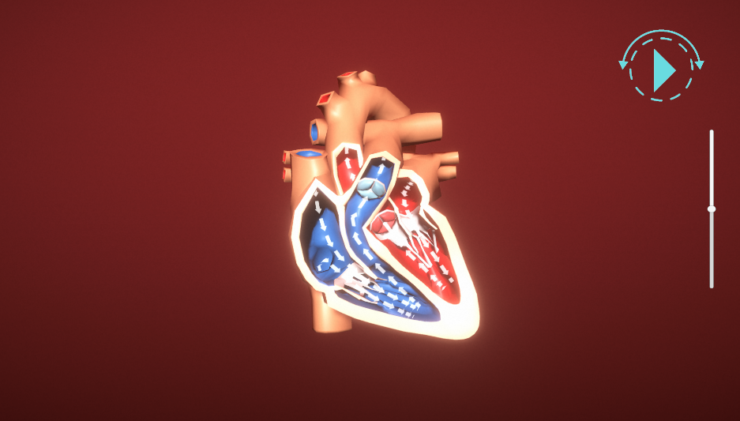
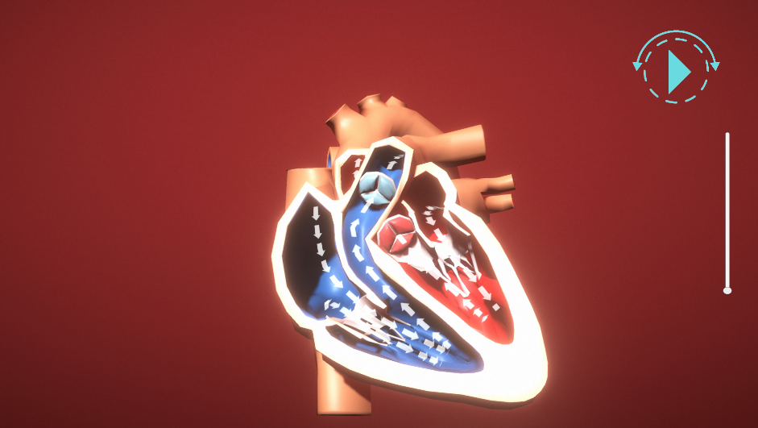
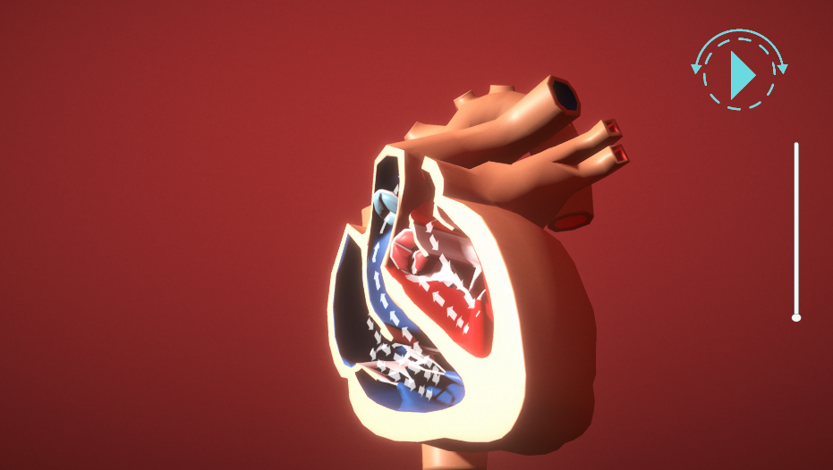
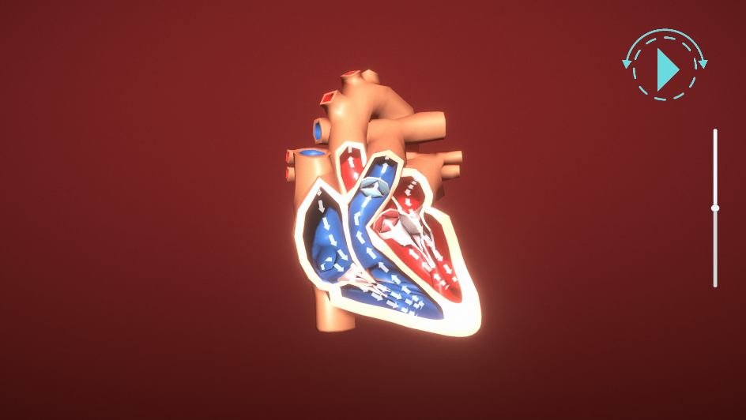

# HeartVisualizer

An interactive 3D heart visualization built with Unity, designed to help users explore the anatomy of the human heart and understand how blood flows through its chambers.



## About

This project started as a way to make cardiac anatomy more approachable. Instead of flipping through textbook diagrams, you can orbit around a detailed cross-section of the heart, watch blood flow animations in real time, and step through different views at your own pace.

The heart model is split open to reveal the internal chambers, valves, and major vessels. Oxygenated blood is shown in red, deoxygenated in blue, and animated arrows trace the path blood takes as it moves through the heart.

## Screenshots

| | |
|:---:|:---:|
|  |  |
| Front view with blood flow arrows | Rotated view of internal structure |
|  |  |
| Side perspective showing depth | Full overview with UI controls |

## Features

- **Interactive Camera** - Click and drag to orbit around the heart from any angle. Scroll to zoom in and out. Works with mouse on desktop and touch on mobile.
- **Blood Flow Animation** - Animated arrows show the direction of blood flow through each chamber and valve, making it easy to follow the circulation path.
- **Heart Beat Animation** - Toggle a beating animation on and off to see the heart in motion.
- **Step-Through Sequences** - Walk through different views or stages of the visualization one at a time using the on-screen controls.
- **Cross-Platform** - Built to run on Windows, iOS, and Android with input handling adapted for each platform.

## Built With

- **Unity 6** (6000.3.4f1)
- **Universal Render Pipeline (URP)** - For modern, efficient rendering with post-processing effects
- **Cinemachine** - Smooth, cinematic camera controls with orbital rigs
- **Timeline** - Sequenced animations for blood flow and heartbeat

## Project Structure

```
Assets/
├── Animations/       # Heart beat and arrow flow animation controllers
├── Materials/        # Anatomically color-coded materials (arteries, veins, valves)
├── Meshes/           # Heart cross-section FBX model and particle meshes
├── Prefabs/          # Heart and blood flow effect prefabs
├── Scenes/           # Main visualization scene
├── Scripts/          # C# scripts for camera, animation, and sequencing
├── Settings/         # URP renderer and quality settings
└── Textures/         # Arrow indicators and UI elements
```

### Key Scripts

| Script | What It Does |
|--------|-------------|
| `InputAxisControl.cs` | Handles camera orbit and zoom across mouse, touch, and gamepad input |
| `AnimToggleValue.cs` | Smoothly toggles animation parameters (used for the heartbeat) |
| `SequencePlayer.cs` | Steps through child objects one at a time for guided viewing |
| `CameraFacing.cs` | Keeps labels and UI elements facing the camera (billboard effect) |

## Getting Started

1. **Clone the repository**
   ```
   git clone https://github.com/shounak00/HeartVisualizer.git
   ```
2. **Open in Unity** - This project requires Unity 6 (version 6000.3.4f1 or later). Open the project through Unity Hub.
3. **Open the scene** - Navigate to `Assets/Scenes/mainScene.unity` and open it.
4. **Hit Play** - Press the Play button in the Unity Editor to start exploring.

## Controls

| Input | Action |
|-------|--------|
| Left Mouse Drag | Orbit the camera around the heart |
| Scroll Wheel | Zoom in and out |
| On-Screen Slider | Fine zoom control |
| On-Screen Buttons | Play/pause animations, step through sequences |
| Touch Drag (Mobile) | Orbit camera |

## License

This project is provided for educational purposes.
